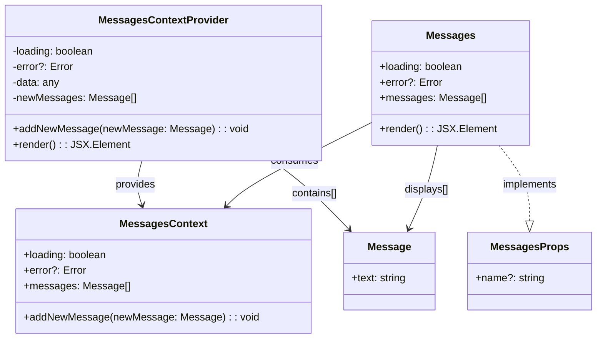
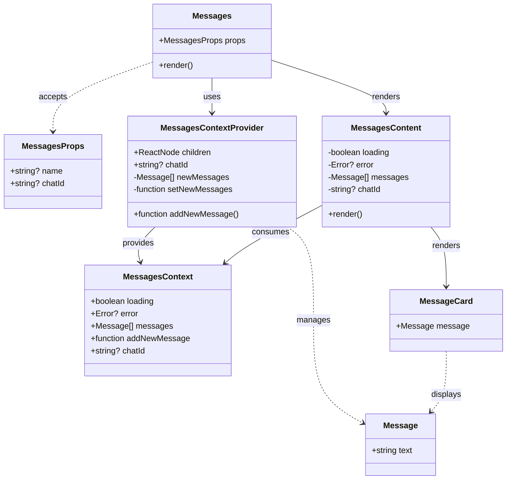
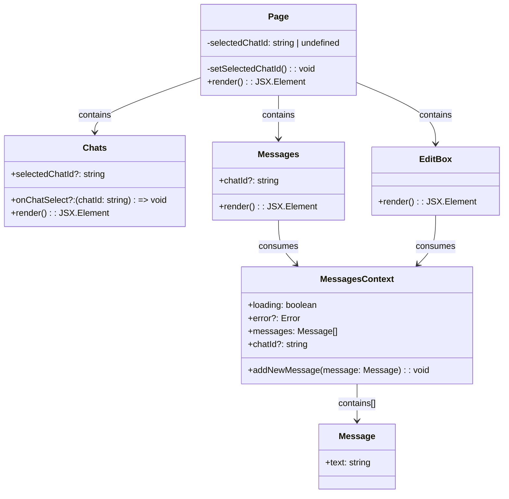
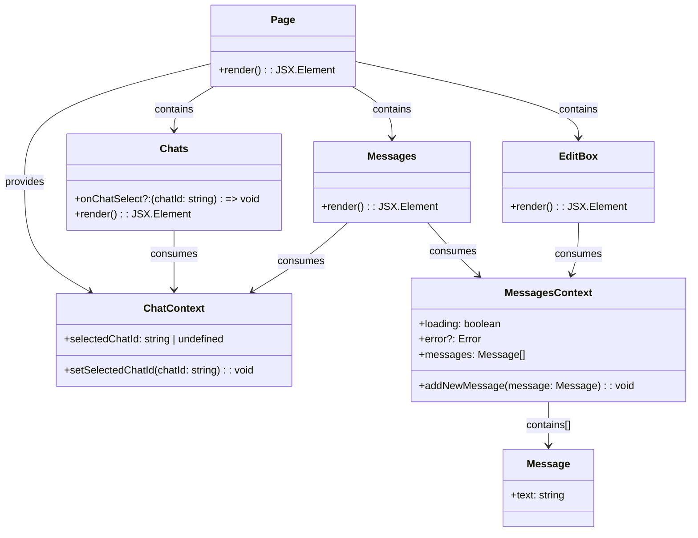

## Relationship Diagram (Messages)

```mermaid
classDiagram
    class MessagesProps {
        +name?: string
    }

    class Message {
        +text: string
    }

    class MessagesContext {
        +loading: boolean
        +error?: Error
        +messages: Message[]
        +addNewMessage(newMessage: Message): void
    }

    class MessagesContextProvider {
        -loading: boolean
        -error?: Error
        -data: any
        -newMessages: Message[]
        +addNewMessage(newMessage: Message): void
        +render(): JSX.Element
    }

    class Messages {
        +loading: boolean
        +error?: Error
        +messages: Message[]
        +render(): JSX.Element
    }

    MessagesContextProvider --> MessagesContext : provides
    Messages --> MessagesContext : consumes
    MessagesContextProvider --> Message : contains[]
    Messages --> Message : displays[]
    Messages ..|> MessagesProps : implements
```

## Relationship Diagram #2 (Messages)

```mermaid
classDiagram
    class Messages {
        +MessagesProps props
        +render()
    }

    class MessagesProps {
        +string? name
        +string? chatId
    }

    class Message {
        +string text
    }

    class MessagesContext {
        +boolean loading
        +Error? error
        +Message[] messages
        +function addNewMessage
        +string? chatId
    }

    class MessagesContextProvider {
        +ReactNode children
        +string? chatId
        -Message[] newMessages
        -function setNewMessages
        +function addNewMessage()
    }

    class MessagesContent {
        -boolean loading
        -Error? error
        -Message[] messages
        -string? chatId
        +render()
    }

    class MessageCard {
        +Message message
    }

    Messages --> MessagesContextProvider : uses
    Messages --> MessagesContent : renders
    MessagesContextProvider --> MessagesContext : provides
    MessagesContent --> MessageCard : renders
    MessagesContent --> MessagesContext : consumes
    MessagesContextProvider ..> Message : manages
    Messages ..> MessagesProps : accepts
    MessageCard ..> Message : displays
```

## Page Diagram

```mermaid
classDiagram
    class Page {
        -selectedChatId: string | undefined
        -setSelectedChatId(): void
        +render(): JSX.Element
    }

    class Chats {
        +selectedChatId?: string
        +onChatSelect?: (chatId: string) => void
        +render(): JSX.Element
    }

    class Messages {
        +chatId?: string
        +render(): JSX.Element
    }

    class EditBox {
        +render(): JSX.Element
    }

    class MessagesContext {
        +loading: boolean
        +error?: Error
        +messages: Message[]
        +addNewMessage(message: Message): void
        +chatId?: string
    }

    class Message {
        +text: string
    }

    Page --> Chats : contains
    Page --> Messages : contains
    Page --> EditBox : contains
    Messages --> MessagesContext : consumes
    EditBox --> MessagesContext : consumes
    MessagesContext --> Message : contains[]
```

## Page Diagram #2

```mermaid
classDiagram
    class Page {
        +render(): JSX.Element
    }

    class ChatContext {
        +selectedChatId: string | undefined
        +setSelectedChatId(chatId: string): void
    }

    class Chats {
        +onChatSelect?: (chatId: string) => void
        +render(): JSX.Element
    }

    class Messages {
        +render(): JSX.Element
    }

    class EditBox {
        +render(): JSX.Element
    }

    class MessagesContext {
        +loading: boolean
        +error?: Error
        +messages: Message[]
        +addNewMessage(message: Message): void
    }

    class Message {
        +text: string
    }

    Page --> ChatContext : provides
    Page --> Chats : contains
    Page --> Messages : contains
    Page --> EditBox : contains
    Chats --> ChatContext : consumes
    Messages --> ChatContext : consumes
    Messages --> MessagesContext : consumes
    EditBox --> MessagesContext : consumes
    MessagesContext --> Message : contains[]
```
