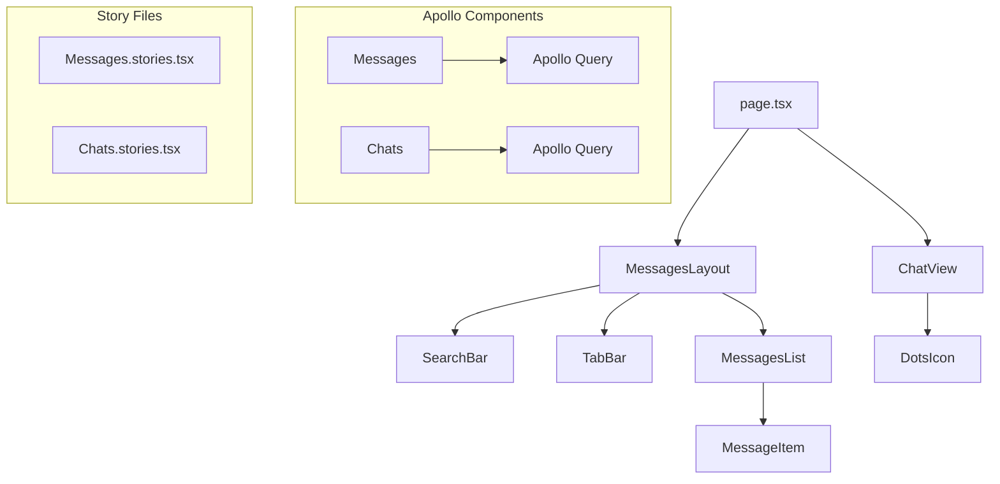

## Relationship Diagram for all components

```mermaid
graph TD
    A[page.tsx] --> B[MessagesLayout]
    A --> C[ChatView]
    
    B --> D[SearchBar]
    B --> E[TabBar]
    B --> F[MessagesList]
    
    F --> G[MessageItem]
    
    C --> H[DotsIcon]
    
    subgraph Apollo Components
        I[Messages] --> J[Apollo Query]
        K[Chats] --> L[Apollo Query]
    end
    
    subgraph Story Files
        M[Messages.stories.tsx]
        N[Chats.stories.tsx]
    end
```    
