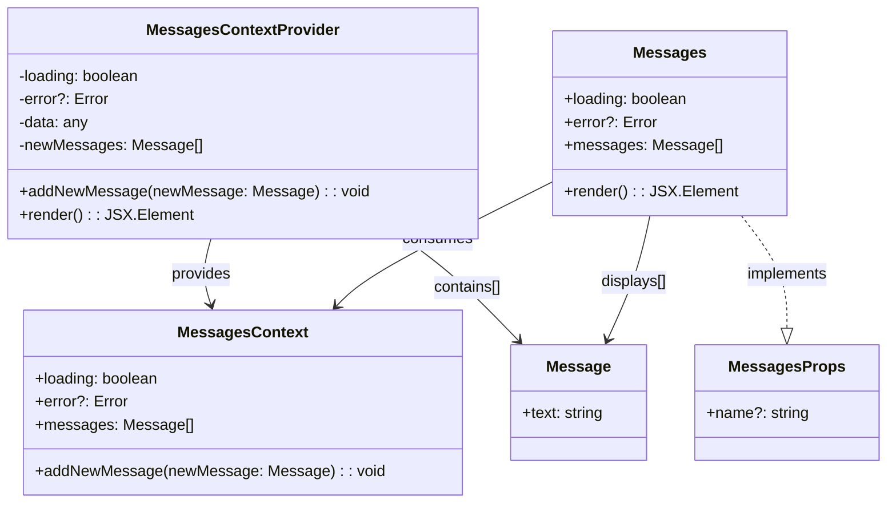

## Relationship Diagram (Messages)

```mermaid
classDiagram
    class MessagesProps {
        +name?: string
    }

    class Message {
        +text: string
    }

    class MessagesContext {
        +loading: boolean
        +error?: Error
        +messages: Message[]
        +addNewMessage(newMessage: Message): void
    }

    class MessagesContextProvider {
        -loading: boolean
        -error?: Error
        -data: any
        -newMessages: Message[]
        +addNewMessage(newMessage: Message): void
        +render(): JSX.Element
    }

    class Messages {
        +loading: boolean
        +error?: Error
        +messages: Message[]
        +render(): JSX.Element
    }

    MessagesContextProvider --> MessagesContext : provides
    Messages --> MessagesContext : consumes
    MessagesContextProvider --> Message : contains[]
    Messages --> Message : displays[]
    Messages ..|> MessagesProps : implements
```    
