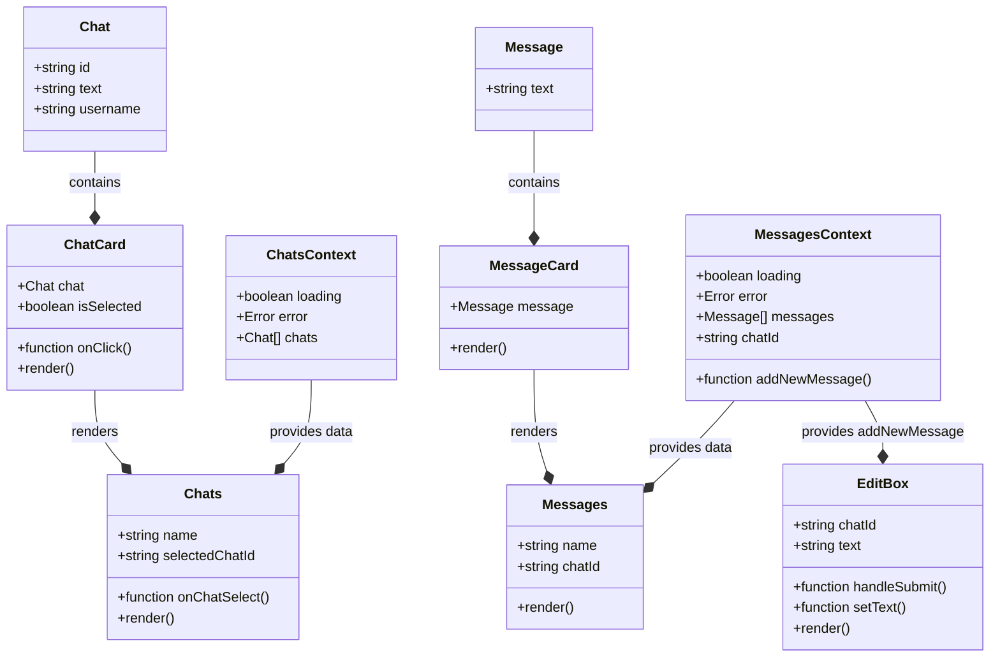

## Component Relationship Diagram

```mermaid

classDiagram
    class Chat {
        +string id
        +string text
        +string username
    }

    class ChatCard {
        +Chat chat
        +boolean isSelected
        +function onClick()
        +render()
    }

    class Chats {
        +string name
        +string selectedChatId
        +function onChatSelect()
        +render()
    }

    class ChatsContext {
        +boolean loading
        +Error error
        +Chat[] chats
    }

    class Message {
        +string text
    }

    class MessageCard {
        +Message message
        +render()
    }

    class Messages {
        +string name
        +string chatId
        +render()
    }

    class MessagesContext {
        +boolean loading
        +Error error
        +Message[] messages
        +function addNewMessage()
        +string chatId
    }

    class EditBox {
        +string chatId
        +string text
        +function handleSubmit()
        +function setText()
        +render()
    }

    Chat --* ChatCard : contains
    ChatCard --* Chats : renders
    ChatsContext --* Chats : provides data
    Message --* MessageCard : contains
    MessageCard --* Messages : renders
    MessagesContext --* Messages : provides data
    MessagesContext --* EditBox : provides addNewMessage

```
