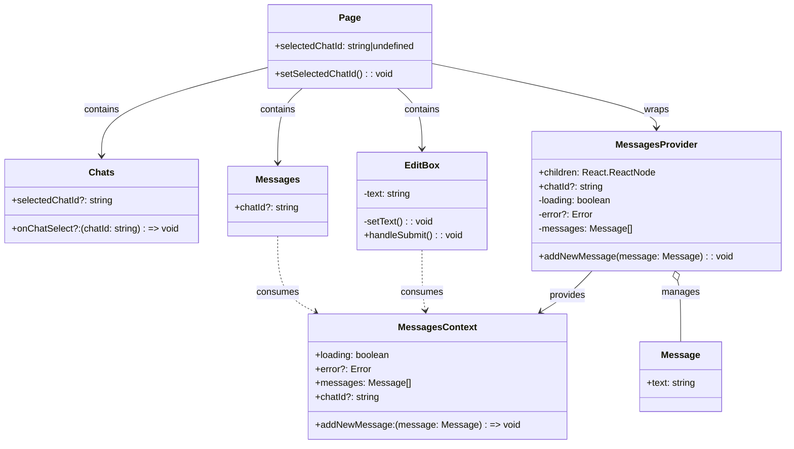

## Component Relationship Diagram (roy4)

```mermaid
classDiagram
    class Page {
        +selectedChatId: string|undefined
        +setSelectedChatId(): void
    }

    class Chats {
        +selectedChatId?: string
        +onChatSelect?: (chatId: string) => void
    }

    class Messages {
        +chatId?: string
    }

    class EditBox {
        -text: string
        -setText(): void
        +handleSubmit(): void
    }

    class MessagesProvider {
        +children: React.ReactNode
        +chatId?: string
        -loading: boolean
        -error?: Error
        -messages: Message[]
        +addNewMessage(message: Message): void
    }

    class MessagesContext {
        +loading: boolean
        +error?: Error
        +messages: Message[]
        +addNewMessage: (message: Message) => void
        +chatId?: string
    }

    class Message {
        +text: string
    }

    Page --> Chats: contains
    Page --> Messages: contains
    Page --> EditBox: contains
    Page --> MessagesProvider: wraps
    MessagesProvider --> MessagesContext: provides
    Messages ..> MessagesContext: consumes
    EditBox ..> MessagesContext: consumes
    MessagesProvider o-- Message: manages
```
    
