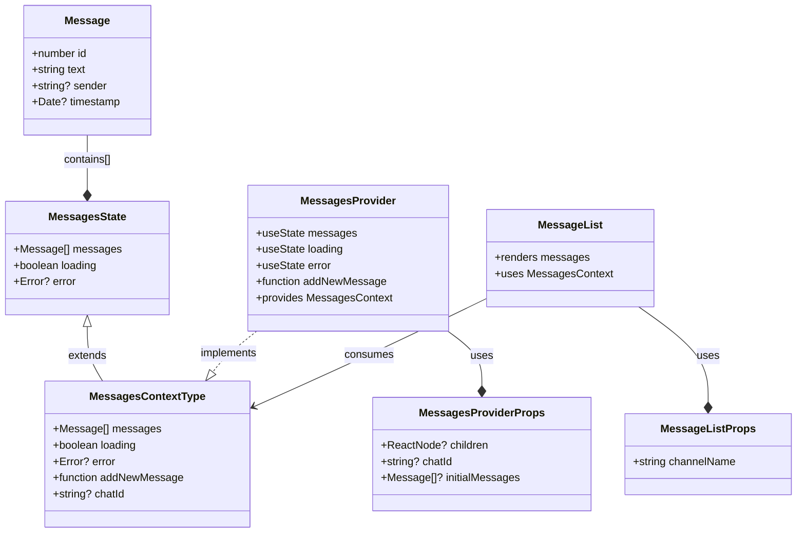

```mermaid
classDiagram
    class Message {
        +number id
        +string text
        +string? sender
        +Date? timestamp
    }

    class MessagesState {
        +Message[] messages
        +boolean loading
        +Error? error
    }

    class MessagesContextType {
        +Message[] messages
        +boolean loading
        +Error? error
        +function addNewMessage
        +string? chatId
    }

    class MessagesProviderProps {
        +ReactNode? children
        +string? chatId
        +Message[]? initialMessages
    }

    class MessageListProps {
        +string channelName
    }

    class MessagesProvider {
        +useState messages
        +useState loading
        +useState error
        +function addNewMessage
        +provides MessagesContext
    }

    class MessageList {
        +renders messages
        +uses MessagesContext
    }

    MessagesState <|-- MessagesContextType : extends
    Message --* MessagesState : contains[]
    MessagesProvider ..|> MessagesContextType : implements
    MessagesProvider --* MessagesProviderProps : uses
    MessageList --* MessageListProps : uses
    MessageList --> MessagesContextType : consumes
```
